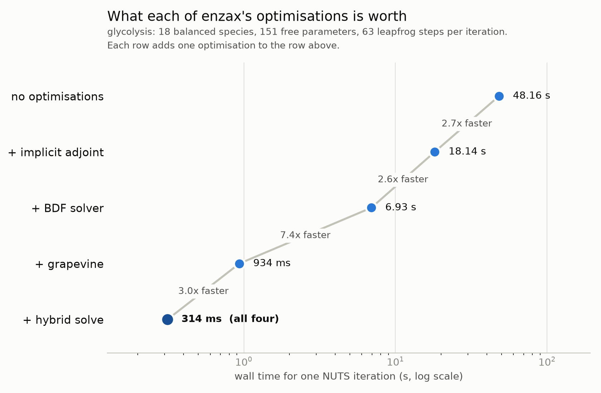

# Performance

Fitting a kinetic model with Hamiltonian Monte Carlo means solving for a steady state, and differentiating that solution, once per leapfrog step. A NUTS iteration that builds a tree of depth 8 does that 255 times, and a four chain run of 1000 iterations does it a million times. Everything enzax does to make sampling faster is aimed at that one operation.

This page describes the four optimisations enzax applies to it, says which of them other frameworks already have, and lists the performance features other frameworks have that enzax does not. `scripts/optimisation_benchmark.py` measures what each one is worth on enzax's glycolysis model; run it to reproduce the figure.

## The four optimisations

**Implicit differentiation of the steady state.** The steady state is a root of `dcdt`, so its parameter sensitivities follow from the implicit function theorem: one linear solve against the Jacobian at the root. The alternative is to differentiate the solver — to backpropagate through, or carry forward sensitivities alongside, every step the integrator took. Enzax passes `diffrax.ImplicitAdjoint` to `diffeqsolve`, so the cost of a gradient does not grow with how long the integration was.

**A BDF solver.** Kinetic models of metabolism are stiff, and a BDF with the linear algebra reuse policy SUNDIALS' CVODE uses — keeping the Jacobian and the factorisation of `I - cJ` across steps, not just across the stages of one step — is the standard answer. [diffrax-bdf](https://github.com/dtu-qmcm/diffrax-bdf) is that solver, written for diffrax, which otherwise offers only the ESDIRK `Kvaerno3/4/5` family. It is a separate package rather than an enzax dependency, so `get_steady_state` still defaults to `Kvaerno5` and takes the BDF through its `solver` argument.

**The grapevine method.** Within one Hamiltonian trajectory, consecutive leapfrog steps are close together, so the steady state found at one step is a good guess for the next. [grapevine](https://github.com/dtu-qmcm/grapevine) augments the velocity Verlet integrator with a guess carried along the trajectory, and `GrapeNUTS` is the NUTS sampler built on it. Enzax's `enzax_log_density_grapevine` returns the steady state alongside the log density, which is what that sampler needs.

**A hybrid forward solve.** `get_steady_state_hybrid` tries a bounded Newton root find on `dcdt` and integrates from whatever it produced. Newton is fast near a steady state and fails outright far from one, and integrating from a sufficiently good starting point takes no steps at all, because the steady state event fires immediately. So the fast path costs nothing when it fails and skips the whole integration when it works.

The last two compound: grapevine is what usually puts the guess inside Newton's basin, and the hybrid solve is what converts a good guess into a skipped integration.

## How other frameworks compare

The frameworks below all offer gradient-based MCMC for general kinetic models, which is the bar for being comparable at all. Tools that fit ODE models but sample without gradients — COPASI, Data2Dynamics, AMIGO2, PyBioNetFit — are left out, as is anything that only optimises.

| | [enzax](https://github.com/dtu-qmcm/enzax) | [Maud](https://github.com/biosustain/Maud) | [pyPESTO](https://github.com/ICB-DCM/pyPESTO) + [AMICI](https://github.com/AMICI-dev/AMICI) | [PEtab.jl](https://github.com/sebapersson/PEtab.jl) | [Turing.jl](https://turinglang.org) + SciML | [PyMC](https://www.pymc.io) + [sunode](https://github.com/pymc-devs/sunode) | [Stan](https://mc-stan.org) |
|---|---|---|---|---|---|---|---|
| Implicit differentiation of the steady state | yes | no | yes | no | yes | n/a | yes |
| Stiff BDF with cross-step Jacobian reuse | yes | yes | yes | yes | yes | yes | yes |
| Guess reuse along the Hamiltonian trajectory | yes | no | no | no | no | no | no |
| Hybrid Newton-then-integrate forward solve | yes | no | yes | no | no | n/a | no |
| Gradient-based sampler | GrapeNUTS (blackjax) | NUTS (Stan) | NUTS (via PyMC) | NUTS (AdvancedHMC) | NUTS | NUTS | NUTS |

`n/a` means sunode has no steady-state solver at all: it integrates to observation times, so a model fitted through it is a time course model rather than a steady state one. It is in the table because it is how one fits a kinetic ODE model with gradients in PyMC, not because it competes on these rows.

Reading the table honestly: only the grapevine method is new. The other three are, individually, what a mature simulation stack already does — they are new *here*, in a JAX program where the rate laws, the solve and the likelihood compile to one XLA executable and the chains can be mapped over.

The details behind each row:

**Implicit differentiation.** AMICI's `newtonOnly` steady-state sensitivity mode solves `J s = -∂f/∂θ` at the root, with a transposed-Jacobian version for adjoint sensitivities, falling back to integrating sensitivities when the Jacobian is singular. Stan's `solve_newton` and `solve_powell` propagate derivatives through the solution "using the implicit function theorem and an adjoint method of automatic differentiation", and SciML's `SteadyStateAdjoint` does the same for a Julia `SteadyStateProblem`. Maud does not: it reaches the steady state by integrating `ode_bdf_tol` to a fixed time point and checking the residual afterwards, so its gradients come from the coupled forward sensitivity system CVODES integrates alongside the states. PEtab.jl's pre-equilibration is likewise differentiated through the solve, by `ForwardDiff`, forward sensitivities or a trajectory adjoint.

**BDF.** Every framework here but enzax gets this from SUNDIALS (CVODES) or from Julia's `QNDF`/`FBDF`/`CVODE_BDF`. AMICI goes further and generates C++ with a symbolically derived sparse Jacobian solved by KLU, which matters more the larger the network. The row is a tick for everyone; it is on the list because in JAX it was not available at all.

**Guess reuse.** No framework we found carries a solution from one leapfrog step to the next. Stan's algebraic solvers take a guess per call with no mechanism for threading the previous call's answer through the sampler's trajectory; AMICI and PEtab.jl start each steady-state solve from the model's initial state. This is the claim the [grapevine paper](https://github.com/dtu-qmcm/grapevine) makes and benchmarks.

**Hybrid forward solve.** AMICI's default `SteadyStateComputationMode.integrateIfNewtonFails` is the same idea, and goes one step further: Newton, then simulate if that failed, then Newton again from the simulated state. PEtab.jl offers `:Simulate` or `:Rootfinding` and does not combine them, and its documentation recommends `:Simulate` on robustness grounds. In Stan a solver failure cannot be branched on, so the fallback cannot be written.

## What other frameworks have that enzax does not

These are performance features outside enzax's four, on the same bar: they make MCMC faster for general kinetic models.

| Framework | Feature | Why it matters |
|---|---|---|
| AMICI | Symbolic model compilation to C++ with a sparse Jacobian and a KLU sparse linear solver | A metabolic network's Jacobian is sparse, and both building it and factorising it get cheaper for saying so. Enzax's are dense — though see the caveat below for what that costs at present sizes, which is less than it sounds. |
| AMICI | ODE adjoint sensitivities for time course data | Makes a gradient's cost independent of the number of parameters. Enzax's implicit adjoint gives this at a steady state, but enzax has no time course likelihood. |
| pyPESTO | Adaptive parallel tempering | Kinetic posteriors are often multimodal, where a single NUTS chain is not slow so much as stuck, and the wall time to a given effective sample size is what suffers. |
| PEtab.jl | `GaussAdjoint`, and a choice between `InterpolatingAdjoint` and `QuadratureAdjoint` | Different adjoints win on different models, and the choice is a keyword rather than a rewrite. |
| PEtab.jl | `sparse_jacobian`, on top of ModelingToolkit's symbolic simplification | Shrinks the system, and the linear algebra in it, before it is ever solved. |
| AMICI, Stan | Within-gradient parallelism over simulation conditions — AMICI's OpenMP `num_threads`, Stan's `reduce_sum` | A sampler is sequential, so the only parallelism a single chain can use is inside one gradient. Enzax parallelises across chains and not within a gradient, which is the wrong axis when the core count is much larger than the chain count. |
| Stan, Maud | `ode_adjoint_tol_ctl`, with separate forward, backward and quadrature tolerances | Lets the backward solve be looser than the forward one, which is usually safe and always cheaper. |
| SciML | A wider stiff-solver menu: `Rodas5P` and the other Rosenbrock-W methods, `QNDF`, `FBDF` | Rosenbrock methods often beat a BDF at the moderate tolerances a likelihood actually needs. diffrax offers the Kvaerno family, plus the one BDF written for it. |
| SciML | GPU-resident ensembles, `EnzymeVJP` | Hardware and AD backends enzax does not reach through diffrax. |
| AMICI | A model compiled once to a shared library on disk | Enzax re-traces and re-compiles every session: about 40 s for the glycolysis log density and its gradient and another 65 s for NUTS, and 35–135 s per configuration in the benchmark below. JAX's persistent cache stores the executable but not the tracing and lowering that produced it, so it removes only part. This is a startup cost rather than a per-iteration one, but it is paid per process, and a chain map that compiles per device pays it per device. |

pyPESTO's hierarchical inner optimisation of scaling, offset and noise parameters is the one thing that looked like it belonged here and does not: it removes parameters from the problem, but it is wired into pyPESTO's optimisers rather than its samplers, so it does not make MCMC faster today.

The first row needs a caveat, because it is the one most likely to be read as a to-do list. Enzax's Jacobians really are dense, but at the size its models are today that costs nothing measurable: on glycolysis, swapping the Newton solve's factorisation between SVD, QR and LU changes the wall time by under 2% and leaves the compiled program byte-identical, and building the 18×18 Jacobian from a 9-colour compression rather than 18 one-hot columns is 8% faster rather than the 2× the colour count suggests, because `jax.jacfwd` already batches its tangents. The crossover where sparsity starts to pay is near 128 species, and past it the lever is cheaper Jacobian *construction* — colouring feeding a dense factorisation — rather than a sparse solve, which is either inapplicable to a Jacobian at condition number 2e9 or unavailable to a vmapped sampler. `llm_plans/sparse_jacobians.md` records the measurements, a validated prototype and the criteria for re-opening the question.

## What the four are worth

`scripts/optimisation_benchmark.py` takes one MCMC iteration from a run of the glycolysis model with all four switched on, and re-times that same iteration with each one removed, cumulatively, in the order above.



Together they are worth **153×** on this model: one NUTS iteration at the tree depth cap goes from 48 s to 314 ms, which is two days of compute against twenty minutes for four chains of a thousand iterations. No single one of them gets you there. The implicit adjoint and the BDF are worth about 2.6× each, the hybrid solve 3×, and the grapevine method 7.4×, and they multiply.

Two of those are model- or position-dependent in a way worth knowing. The BDF is worth 2.6× here and only 1.4× on the five-species methionine model: keeping the Jacobian and its factorisation across steps matters more the bigger and stiffer the system. And the hybrid solve's 3× is measured at a posterior draw, where grapevine's guess is inside Newton's basin; averaged over a whole run, including the early warmup draws where Newton fails and the fallback integration runs anyway, it is smaller.

The script's own documentation says how it gets that iteration and what it assumes in re-pricing it. To regenerate this figure:

```sh
uv run --group mcmc python scripts/optimisation_benchmark.py \
    --out-prefix docs/img/optimisation_benchmark
```

That writes the figure and, beside it, a csv with one row per timed leapfrog step.
